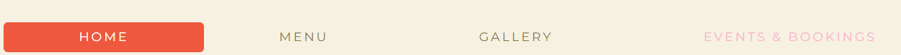

# Petals and Potions Cafe Website # 

[View the live Project here.] ###

Welcome to the Petals and Potions Cafe website read.me, this website was created for milestone project 1 (Web Development Diploma with Code Institute) and it showcases a beautifully designed, floral-inspired fictional cafe. The website features four main pages:

1. Home Page: ADD LINK
- Includes a hero image with buttons to navigate to the menu and learn more about us sections, followed by an about us section and a footer with contact details and social media links.

2. Menu Page: ADD LINK
- Displays the cafe's diverse menu, organized into sections for drinks, food, and desserts, complete with detailed descriptions and prices.

3. Gallery Page: ADD LINK
- Features a collection of images showcasing the cafe's delicious food, cakes, drinks, and the charming cafe ambiance.

4. Events & Booking Page: ADD LINK
- Lists upcoming and recurring events with details and includes a booking enquiry form for customers to easily make reservations, also showcasing some workshop event images.

This is where the image with different browsers and screen sizes will go TBC

## User Experience (UX)

   ### Project Goal
   
   #### User stories
   
   ##### Potential Customer Goals
   - As a potential customer, I want to learn more about Petals and Potions Cafe, so that I can decide if it’s a place I’d like to visit.
   - When I visit the homepage, I want to understand the main purpose of the site and be able to find out more about the Cafe and it's location. 
   - As a potential Customer, I want to see what the Cafe looks like and if it is somewhere where I see myself visiting. I should be able to use the navigation bar to access the Gallery section easily. 
   - I want to view the menu to see what the Cafe offers. I should be able to easily access the menu page from the homepage to see the variety of food and drinks available along with dietary options.

   ##### Returning Customer Goals
   - As a returning customer, I want to stay updated on new menu items and upcoming events, so that I can continue to enjoy fresh and exciting experiences at the Petals and Potions Cafe.
   - As a returning Customer, I want to be able to any changes to the menu. I should be able to use the navigation bar to access the menu easily and any new items on the menu should be highlighted. 
   - I want to be able to see any upcoming events. The navigation bar should take me to the Events and Bookings section. I should be able to see the dates, times and prices of the events clearly and be able to make reservations using a simple and efficient submission process.
   - I want to be able to subscribe to the newsletter in order to receive special offers and receive communication regarding upcoming events. 

## Design
   ### Colour Scheme
   - The main colours of the website are ceramic white, pastel pink and light khaki.
   - Orange and red in some of the content and buttons to add a vibrant feel to the website as well as contrast.
   - I used [Color Mind](http://colormind.io/) to decide which colours would look well together. 
   ### 

   ### Typography
   - The Montserrat font is the main font used throughout the whole website with Sans Serif as the fallback font.
   - Bebas Neue is used on h1, h2 and h3's with Sans Serif as the fallback font.

   ### Imagery
   -  [Pexels](https://www.pexels.com/) images have been used for all images throughout the website. 

   -  Home page images:

      1. [Home hero image](#)
      1. [Founders images](#)

   -  Gallery:

      1. [Gallery image 1](#)
      1. [Gallery image 2](#)

   -  Events and Bookings:

      1. [Events hero image](#)

## Wireframes and Structure

I used Balsamiq to create my wireframes. These were a rough idea of what I wanted to achieve, however I did make some changes to the structure of the page whilst coding, please see below for more information.

1. As shown in the wireframes, I first wanted to add the contact information below the about us section. However, whilst coding I realised that contact information is very important for the user and that  it would be handy to include it in the footer. This way the user can view the contact information on any page and it will also be a lot easier and quicker to find. 

2. I amended the structure of the menu and changed the name of 'bevergaes' to 'drinks'. I reliased that having the menu sections horizontally aligned wouldn't give me much space and it would have probably looked a little too constricted. 

3. I rearranged the layout of the gallery as I thought it looks neater when the photos are in two columns. 

4. After noticing that the home page looked too empty I decided to add the founders and our story section. 

5. While coding I decided to add a testimonials section to the events and bookings page to seperate the upcoming events section and the enquiries form. I think that this makes the page look more complete. I also added a map at the bottom of the enquiry form for good UI experience.

### Wireframes

- Home Page Wireframe - [view](documentation/wireframes/home.png)

- Menu Page Wireframe - [view](documentation/wireframes/menu.png)

- Gallery Page Wireframe - [view](documentation/wireframes/gallery.png)

- Events & Bookings Page Wireframe - [view](documentation/wireframes/events-booking.png)

- Mobile Home Page Wireframe - [view](documentation/wireframes/phone-home.png)

- Mobile Menu Page Wireframe - [view](documentation/wireframes/phone-menu.png)

- Mobile Gallery Page Wireframe - [view](documentation/wireframes/phone-gallery.png)

- Mobile Events & Bookings Page Wireframe - [view](documentation/wireframes/phone-events-bookings.png)

- Tablet Home Page Wireframe - [view](documentation/wireframes/ipad-home.png)

- Tablet Menu Page Wireframe - [view](documentation/wireframes/ipad-menu.png)

- Tablet Gallery Page Wireframe - [view](documentation/wireframes/ipad-gallery.png)

- Tablet Events & Bookings Page Wireframe - [view](documentation/wireframes/ipad-events-bookings.png)

## Features

-   #### Responsive on all devices - [view]

### Interactive elements

-  Navagation has a link to the home, menu, gallery and events & bookings pages.
### 

-  The hero image on the home page includes two buttons: Learn more about us and explore our menu.  The learn more about us buttons takes the user to the about us section on the home page. The explore our menu button takes the user to the menu page.
### 

#### All pages contain the same header and footer. 

### Header:
- The header includes a very simple logo. Beneath the logo is the horizontal negivation section which is easy to see and operate making it user friendly. The navigation turns into a sidebar on smaller screen sizes.

## 
## 

### Footer:
- The footer includes all contact information including telephone number, email address, venue address as well as social media links. 

## 

## Technologies

### Languages

- [HTML5](https://en.wikipedia.org/wiki/HTML5) 
- [CSS3](https://en.wikipedia.org/wiki/Cascading_Style_Sheets)

### Frameworks and Libraries

1. [Bootstrap v.5.2.3](https://getbootstrap.com/docs/5.2/getting-started/introduction/)
- Bootstrap was used to make sections of the website responsive by using the bootstrap grid system. Bootstrap was also used for styling some of the sections of the website such as the nav.  
2. [jQuery](https://jquery.com/)
- jQuery came with Bootstrap for responsive purposes, jQuery was also used in the sidebar. Please note that the jQuery code for the sidebar was taken from youtube. 
3. [Balsamiq](https://balsamiq.com/)
- Balsamiq was used to create the wireframes for the different device sizes.
4. [Am I Responsive Design](http://ami.responsivedesign.is/)
- Am I Responsive Design was used for the responsive image in the Readme.
5. [Google Fonts](https://fonts.google.com/)
- The following fonts were imported from google fonts: Montserrat and Bebas Neue.
6. [Font Awesome](https://fontawesome.com/icons)
- Font Awesome was used to import icons used throughout the website. 
7. [Github](https://github.com/)
- Github was used to store the project. 
8. [Git](https://git-scm.com/)
- Git was used for version control by utilizing the Gitpod terminal to commit to Git and Push to GitHub.

## Testing

## Deployment

## Credits

Events and Bookings Page positioning https://love2dev.com/blog/absolute-centering-css/

