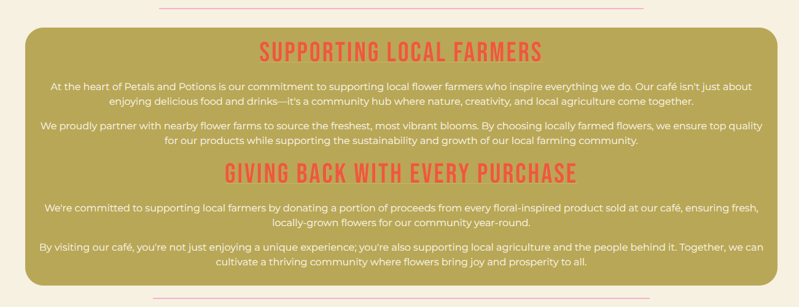
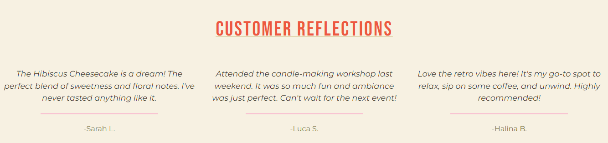

# Petals and Potions Cafe Website # 

[View the live Project here.] ###

Welcome to the Petals and Potions Cafe website read.me, this website was created for milestone project 1 (Web Development Diploma with Code Institute) and it showcases a beautifully designed, floral-inspired fictional cafe. The website features four main pages:

1. Home Page: ADD LINK
- Includes a hero image with buttons to navigate to the menu and learn more about us sections, followed by an about us section, founders section and a footer with contact information, opening hours and social media links.

2. Menu Page: ADD LINK
- Displays the cafe's diverse menu, organised into sections for drinks, food, and desserts, complete with detailed descriptions and prices.

3. Gallery Page: ADD LINK
- Features a collection of images showcasing the cafe's delicious food, cakes, drinks, and the charming cafe ambiance.

4. Events & Booking Page: ADD LINK
- Lists detailed upcoming events on a large hero image, including a book here button. This page also includes a testimonials section and a booking enquiry form for customers to easily make reservations, followed by a map to help organise their visit.

This is where the image with different browsers and screen sizes will go TBC

## User Experience (UX)

   ### Project Goal
   - The website is the online reflection of the floral inspired Cafe, embodying the dedication to community by showing the upcoming events section, creativity by providing a vibrant theme and a unique floral-isnpired menu, and supporting local farmers by explaining how the Cafe suports local farmers in the about us section. 

   - The website is a platform where visitors can explore the menu, learn about upcoming events, and easily make reservations. Beyond that, it’s a space to share the story of how the cafe was created, highlight the local flower farmers, and invite the community to join in, in celebrating the beauty of flowers in every aspect of the café.

   - Through this website, the aim is to create an online experience that mirrors the warmth and charm of the physical space, making it easier for the customers to engage with the cafe, stay informed about what’s happening at the café, and feel a part of the thriving community.
   
   #### User stories
   
   ##### First Time Visitor Goals
   - I want to find out more about the Cafe. 
   - I want to see the location of the Cafe.
   - I want to see what the Cafe and the offerings look like and if it is somewhere where I see myself visiting. I should be able to use the navigation bar to access the Gallery section easily. 
   - I want to view the menu to see what the Cafe offers. I should be able to easily access the menu page to see the variety of food and drinks available along with dietary options.
   - I want to book a table easily.

   ##### Returning Customer Goals
   - As a returning customer, I want to view the upcoming events.
   - As a returning Customer, I want to be able to see any changes to the menu. 
   - I want to make reservations or send an enquiry using a simple and efficient submission process.
   - I want to be able to find the contact information and location of the Cafe easily. 
   <!--
   - I want to be able to subscribe to the newsletter in order to receive special offers and receive communication regarding upcoming events. 
   -->

   ##### Frequent Customer Goals
   - I want to view the upcoming events.
   - I want to see the changes to the menu.
   - I want to book a table/ upcoming event.

## Design
   ### Colour Scheme
   - The main colours of the website are ceramic white, pastel pink and light khaki.
   - Orange and red in some of the content, elements and buttons to add a vibrant feel to the website as well as contrast.
   - I used [Color Mind](http://colormind.io/) to decide which colours would look well together. 
   ### 

   ### Typography
   - The Montserrat font is the main font used throughout the whole website with Sans Serif as the fallback font.I think that this font contrasts well with the headings as it is quite delicate and it adds a classy and neat vibe. 
   - Bebas Neue is used on h1 and h2 with Sans Serif as the fallback font. This font adds a retro/ whimsy feel to the website and it is very bold meaning that it stands out, I think that this is good for headings.

   ### Imagery
   -  [Pexels](https://www.pexels.com/) images have been used for all images throughout the website. 

   -  Home page images:

      1. [Home hero image](#)
      1. [Founders images](#)

   -  Gallery:

      1. [Gallery image 1](#)
      1. [Gallery image 2](#)

   -  Events and Bookings:

      1. [Events hero image](#)

## Wireframes and Structure

I used Balsamiq to create my wireframes. These were a rough idea of what I wanted to achieve, however I did make some major changes to the structure of the pages whilst coding, please see below for more information.

1. As shown in the wireframes, I first wanted to add the contact information below the about us section. However, whilst coding I realised that contact information is very important for the user and that  it would be handy to include it in the footer. This way the user can view the contact information on any page and it will also be a lot easier and quicker to find. 

2. I amended the structure of the menu and changed the name of 'bevergaes' to 'drinks'. I reliased that having the menu sections horizontally aligned wouldn't give me much space and it would have probably looked a little too constricted. I also added a book here button to make it easy for the user to access the bookings form. 

3. I rearranged the layout of the gallery as I thought it looks neater when the photos are in two columns. 

4. After noticing that the home page looked too empty I decided to add the local support, founders and our story sections. 

5. While coding I decided to add a testimonials section to the events and bookings page to seperate the upcoming events section and the enquiries form. I think that this makes the page look more complete. I also added a map at the bottom of the enquiry form for good UI experience.

6. I added a back to top button on all pages for good user experience. 

### Wireframes

- Home Page Wireframe - [view](documentation/wireframes/home.png)

- Menu Page Wireframe - [view](documentation/wireframes/menu.png)

- Gallery Page Wireframe - [view](documentation/wireframes/gallery.png)

- Events & Bookings Page Wireframe - [view](documentation/wireframes/events-booking.png)

- Mobile Home Page Wireframe - [view](documentation/wireframes/phone-home.png)

- Mobile Menu Page Wireframe - [view](documentation/wireframes/phone-menu.png)

- Mobile Gallery Page Wireframe - [view](documentation/wireframes/phone-gallery.png)

- Mobile Events & Bookings Page Wireframe - [view](documentation/wireframes/phone-events-bookings.png)

- Tablet Home Page Wireframe - [view](documentation/wireframes/ipad-home.png)

- Tablet Menu Page Wireframe - [view](documentation/wireframes/ipad-menu.png)

- Tablet Gallery Page Wireframe - [view](documentation/wireframes/ipad-gallery.png)

- Tablet Events & Bookings Page Wireframe - [view](documentation/wireframes/ipad-events-bookings.png)

## Features

-   #### Responsive on all devices - [view]

MENTION THAT THE BUTTONS GET SMALLER ON SMALL SCREEN SIZES TO MAKE THE CONTENT MORE BLANCED.

## Header and footer

All pages contain the same header and footer. 

### Header:
- The header includes a very simple logo. Beneath the logo is the horizontal negivation section which is easy to see and operate making it user friendly. The navigation turns into a sidebar on smaller screen sizes to make the page more user friendly and easier to navigate.

## 
## 

### Footer:
- The footer includes all contact information including telephone number, email address, venue address as well as social media links. The footer folds on smaller screen sizes to make it more visable and to show responsive design.

## 
## 

### Back to top button
- All pages include a back to top button at the bottom of the page.

## 

### Interactive elements

-  Navagation has a link to the home, menu, gallery and events & bookings pages.
### 

-  The hero image on the home page includes two buttons: Learn more about us and explore our menu.  The learn more about us buttons takes the user to the about us section on the home page. The explore our menu button takes the user to the menu page.
### 

-  All pages include the back to top arrows allowing the users to easily go to the top of each page.
### 

- The footer has social media links which take the user to the specific social media page. The email is also interactive and automatically brings up an email window when the user clicks on the email address. 
### 

- At the bottom of the menu, we can find a book now button which takes the user to the events and bookings page. I think that this is a good place to add a book now button because if the user likes the menu then they will want to book a table. Adding the button makes the page more interactive and user friendly.  
### 

- The events section includes a book here button. This button takes the user to the bookings form. 
### 

- The bookings form has a send enquiry button. The form itself is also interactive as you can select the amount of people you are bookings for on the 'number of people' field, you can also select a date from the calendar on the 'booking date' field. I think that this makes the form more user friendly and it also minimises a probability of a typo. 
### 

- There is a map at the bottom of the enquiry form to allow the user to plan their journey and see the exact location fo the cafe. Please note that the address of the cafe is not real as this is a fictional cafe. 
### 

### Other elements

#### Home Page

- The about us section on the home page focuses on what makes petals and potions unique. This is a section where the potential customer can really get a feel of the cafe. 
### 

- Below the about us section we can find the supporting local farmers section. I wanted to include this as I wanted to emphasise that the cafe is commited to supporting it's community. 
### 

- Lastly, the founders and our story section really helps the customer connect to the cafe and it build trust. This section also completes the page and makes the content look more vibrant. 
### 

#### Menu Page

- The menu page features four different sections: Seasonal Specials, Drinks, Food and Sweet Treats. All vegan and gluten-free items have an icon next to them. The menu also has a 'New' badge next to all new items so that returning customers can easily see any changes to the menu. The svg at the top of the page is there for aesthetic purposes only. 
### 

- At the bottom of the page we can find the dietary requirement explanation.
### 

- The menu is responsive on smaller screens and it turns into one column rather than two on small devices like mobile phones. 
### 

#### Gallery Page

- The gallery shows eight different photos of the cafe and the offerings. The photo's are shown two columns.
### 

#### Events and Bookings Page

- The events and booking page features an upcoming events section showing all upcoming events. I have stuck to two events as I did not want to overload the page. 
### 

- The customer reflections includes three testimonials. This sections helps seperate the upcoming events and form content and adds a nice contrast. It is also useful for the customer to see what others think of the cafe before booking so I thought it would be a good idea to place this section above the bookings form. 
### 

- Finally, the bookings form allows the user to send an enquiry. I have seperated the form into two different sections: Your details and booking information. This gives thr user clarity and makes the process of completing the form more structured. The 'your details' section is marked as required so the user cannot send the enquiry without completing this information.
### 

## Technologies

### Languages

- [HTML5](https://en.wikipedia.org/wiki/HTML5) 
- [CSS3](https://en.wikipedia.org/wiki/Cascading_Style_Sheets)

### Frameworks and Libraries

1. [Bootstrap v.5.2.3](https://getbootstrap.com/docs/5.2/getting-started/introduction/)
- Bootstrap was used to make sections of the website responsive by using the bootstrap grid system. Bootstrap was also used for styling some of the sections of the website such as the nav.  
2. [jQuery](https://jquery.com/)
- jQuery came with Bootstrap for responsive purposes, jQuery was also used in the sidebar. Please note that the jQuery code for the sidebar was taken from youtube. 
3. [Balsamiq](https://balsamiq.com/)
- Balsamiq was used to create the wireframes for the different device sizes.
4. [Am I Responsive Design](http://ami.responsivedesign.is/)
- Am I Responsive Design was used for the responsive image in the Readme.
5. [Google Fonts](https://fonts.google.com/)
- The following fonts were imported from google fonts: Montserrat and Bebas Neue.
6. [Font Awesome](https://fontawesome.com/icons)
- Font Awesome was used to import icons used throughout the website. 
7. [Github](https://github.com/)
- Github was used to store the project. 
8. [Git](https://git-scm.com/)
- Git was used for version control by utilizing the Gitpod terminal to commit to Git and Push to GitHub.

## Testing

### User Story Testing 

| **First Time Visitor Goals** | **Solution** | **Outcome** |
| ---| ---| ---|
|I want to find out more about the Cafe. | The home page featured an easily visible 'Learn more about us' button which takes the user to the 'About Us' section.| Complete
|I want to see the location of the Cafe.| The location of the Cafe is easily visible in the footer, there is also a map on the events and bookings page below the enquiry form to support the user with planning their journey.| Complete
|I want to see what the Cafe and the offerings look like and if it is somewhere where I see myself visiting. I should be able to use the navigation bar to access the Gallery section easily. | The gallery featured a  variety of photographs including food, drinks, flowers and the cafe itself.| Complete
|I want to view the menu to see what the Cafe offers. I should be able to easily access the menu page to see the variety of food and drinks available along with dietary options.|The menu is easily accessible via the navigation bar. The menu includes detailed descriptions, prices and dietary requirement icons. The home page also includes an easily visible 'Explore our menu' buttons which makes it easy for the user to find the menu.| Complete
|I want to book a table easily. | The User can simply book a table via the bookings form on te events and bookings page. There is also a 'book now' button at the bottom of the menu which takes the user to the events and bookings page. | Complete

| **Returning/ Frequent Visitor Goals** | **Solution** | **Outcome** |
| ---| ---| ---|
|I want to view the upcoming events. | The User can view the upcoming events by clicking on the Events and Bookings page via the nav. | Complete
|I want to be able to see any changes to the menu. | The menu features a vibrant badge showing all 'New' items on the menu. | Complete
|I want to make reservations or send an enquiry using a simple and efficient submission process. | The bookings forms is very straight forward to use and it does not take a long time to complete. | Complete
|I want to be able to find the contact information and location of the Cafe easily. | All contact information is included in the footer on every page making it very easily accessible. | Complete

#### Summary
- Overall, the website is easy to navigate as it has a very simple navigation at the top of every page along with a footer which provides important information. The interactive elements keep to users engaged and they also make it easier to access certain information. The buttons encourage the user to stay engaged and view the menu. The book now button has been placed strategically to encourage users to book a table. While booking the user is also exposed to upcoming events which again, provides more engagement and potential bookings. 

### Links and Functions

| **Page** | **Testing** | **Outcome** |
| ---| ---| ---|
|All| Navigation links go to the correct page| Complete|
|All| Header links back to the home page| Complete|
|All| Social Media links to relevant platforms| Complete|
|All| All content is responsive| Complete|
|BOOKING| Booking form works as intended- Required fields| Complete|

### Browser Testing

-  Google Chrome [view](#)
-  Internet Explorer [view](#)
-  Microsoft Edge [view](#)
-  Firefox [view](#)

#### The website was viewed on such devices as: 
- Desktop [view](#)
- Laptop [view](#)
- iPhone [view](#)

- Please note that the website has also been tested by family and friends who have reported no issues. 

### Google Dev Tools & Lighthouse

- [Google DevTools](https://developer.chrome.com/docs/devtools/) and Lighthouse have been used for testing and amending the project.

#### Bug Fix 1
- #### Before:
#### 
- #### After:
#### 

#### Bug Fix 2
- #### Before:
#### 
- #### After:
#### 

#### Bug Fix 3
- #### Before:
#### 
- #### After:
#### 

#### Bug Fix 4
- #### Before:
#### 
- #### After:
#### 

### Known Bugs

-   Gallery- the first image on the right is not equal in height to all the other images creating an uneven gap between the images. 
-   #

## Deployment

### Forking the GitHub Repository

By forking the GitHub Repository we make a copy of the original repository on our GitHub account to view and/or make changes without affecting the original repository by using the following steps...

1. Log in to GitHub and locate the [GitHub Repository](https://github.com/Adriannap26/Petals-and-Potions.git)
2. At the top of the Repository (not top of page) just above the "Settings" Button on the menu, locate the "Fork" Button.
3. You should have a copy of the original repository in your GitHub account.

### Making a Local Clone

1. Log in to GitHub and locate the [GitHub Repository](https://github.com/Adriannap26/Petals-and-Potions)
2. Under the repository name, click "Clone or download".
3. To clone the repository using HTTPS, under "Clone with HTTPS", copy the link.
4. Open Git Bash
5. Change the current working directory to the location where you want the cloned directory to be made.
6. Type `git clone`, and then paste the URL you copied in Step 3.

$ git `clone https://github.com/Adriannap26/Petals-and-Potions.git`

7. Press Enter. Your local clone will be created.

Click [Here](https://help.github.com/en/github/creating-cloning-and-archiving-repositories/cloning-a-repository#cloning-a-repository-to-github-desktop) to retrieve pictures for some of the buttons and more detailed explanations of the above process.

Alternatively, if using Gitpod, you can click below to create your own workspace using this repository.

## Credits

Events and Bookings Page positioning https://love2dev.com/blog/absolute-centering-css/

